# Incubyte assignment (Rails)

Admin-only HR-style app: manage **job titles**, **employees**, and **TDS (tax withholding) rules**; view **salary metrics** and a **workforce dashboard** with charts. Net salary uses the effective TDS rate for each employee’s country on a chosen **reference date**.

## Requirements

- **Ruby** 3.2.2 (see `.ruby-version`)
- **Rails** ~> 8.1 (`Gemfile`)
- **SQLite** 3 (via `sqlite3` gem)

## Run the app

```bash
bundle install
bin/rails db:prepare    # creates DB, runs migrations, loads schema; run db:seed separately if needed
bin/rails db:seed      # optional: sample job titles + employees (see [Seeds](#seeds))
bin/rails server      # http://localhost:3000
```

Or use `./bin/dev` if your `Procfile.dev` defines processes (e.g. CSS watcher).

**First admin:** Devise **registerable** is enabled for `Admin`. Open **`/admins/sign_up`**, create an account, then sign in. Alternatively, create one in the console:

```ruby
Admin.create!(email: "you@example.com", password: "your-secure-password", password_confirmation: "your-secure-password")
```

Protected areas redirect to **`/admins/sign_in`** when not authenticated.

## Tests

```bash
bundle exec rspec
```

## Database schema

SQLite; schema version and full DDL live in `db/schema.rb`. Summary:

| Table        | Purpose |
|-------------|---------|
| **admins**   | Devise admin users (`email`, `encrypted_password`, reset/remember tokens, timestamps). Unique index on `email`. |
| **job_titles** | Role names (`title`, unique). |
| **employees** | `first_name`, `last_name`, `country` (ISO-style code from `Countries::KEYS`), `salary` (decimal 12,2), `job_title_id` → `job_titles`. |
| **tds_rules** | Per-country withholding rules: `country`, `tds_rate` (0..1), `effective_from`, optional `effective_to`. Unique on `(country, effective_from)`. |

Foreign key: `employees.job_title_id` → `job_titles.id`.

## Routes

| Method | Path | Purpose |
|--------|------|---------|
| GET | `/` | Home (public) |
| GET | `/up` | Health check |
| Devise | `/admins/sign_in`, `/admins/sign_up`, … | Admin authentication |
| GET | `/dashboard` | Workforce & salary charts (admin) |
| GET | `/salary_metrics` | Redirects to `/salary_metrics/job_title` |
| GET | `/salary_metrics/job_title` | Metrics by job title |
| GET | `/salary_metrics/country` | Metrics by country |
| GET | `/api/dashboard/charts` | JSON for dashboard charts (same filters as query params) |
| GET | `/api/salary_metrics/by_job_title` | JSON aggregates by job title |
| GET | `/api/salary_metrics/by_country` | JSON aggregates by country |
| CRUD | `/job_titles` | index, show, new, create, edit, update (**no destroy**) |
| CRUD | `/employees` | full resource including **destroy** |
| CRUD | `/tds_rules` | index, show, new, create, edit, update (**no destroy**) |

Use `bin/rails routes` for the full list.

## Application flow

1. **Public home** (`/`) — landing; links to sign in / sign up.
2. **Sign in** — admins access **Employees**, **Job titles**, **TDS rules**, **Salary metrics**, and **Dashboard** from the nav.
3. **Job titles** — maintain the catalog; employees must reference a job title (`JobTitle` restricts deletion if employees still use it).
4. **Employees** — CRUD with filters/search/pagination on the index; list defaults to **newest first** (`created_at` desc).
5. **TDS rules** — define time-bounded rates per country; salary metrics and dashboard use **`TdsRule.effective_tds_rate_for_country`** (see below).
6. **Salary metrics** — pick a **TDS reference date** (`as_of`) and either a **job title** or **country** to see averages and per-employee gross/net.
7. **Dashboard** — multi-chart view driven by **`Dashboard::ChartData`**; optional JSON at **`/api/dashboard/charts`** with the same filter query params.

## Screenshots

Images are stored under [`docs/screenshots/`](docs/screenshots/).

### Home

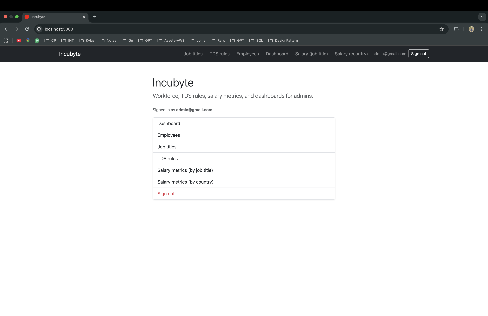

### Employees

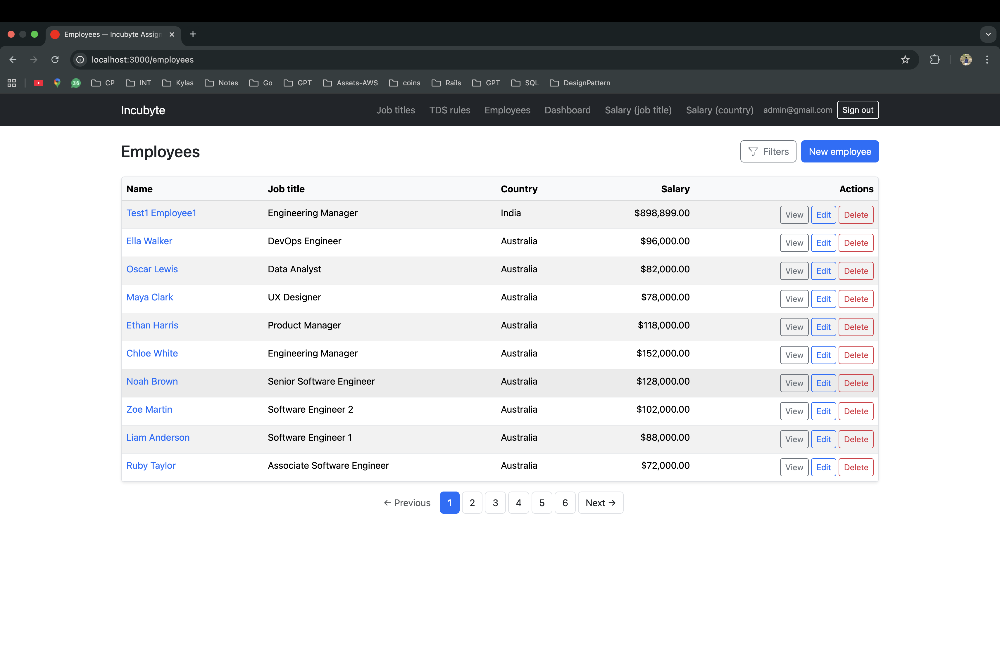

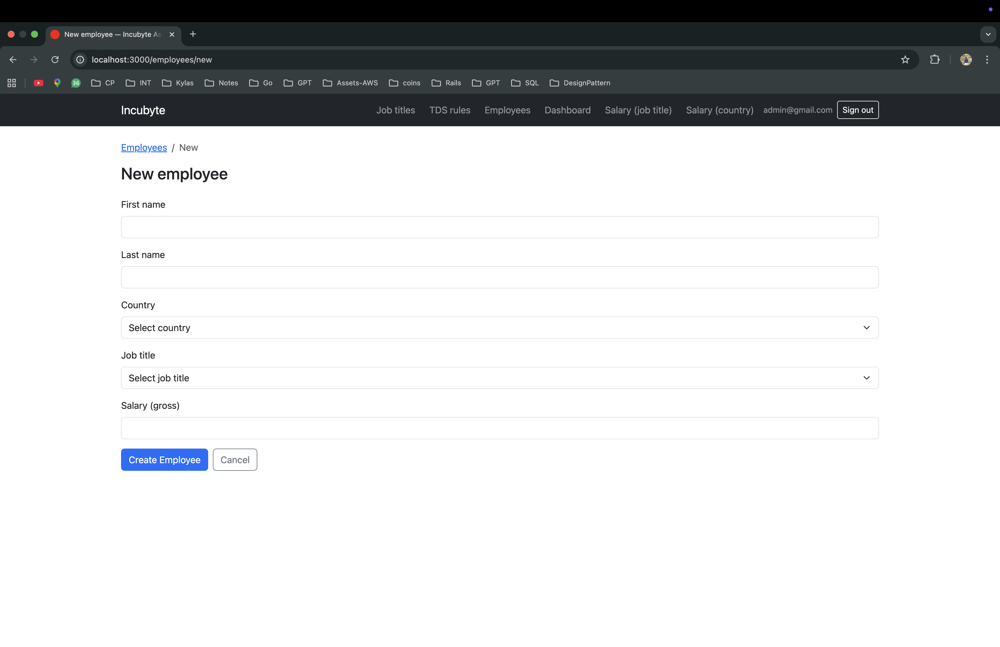

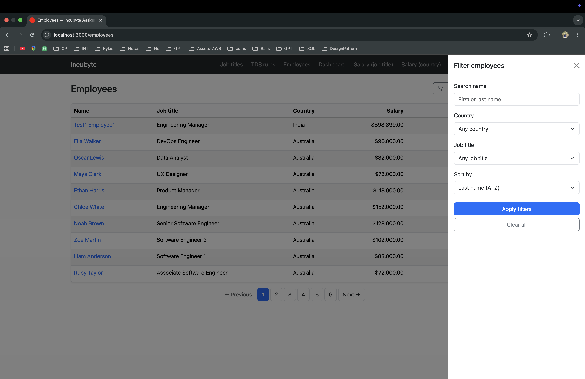

### Job titles

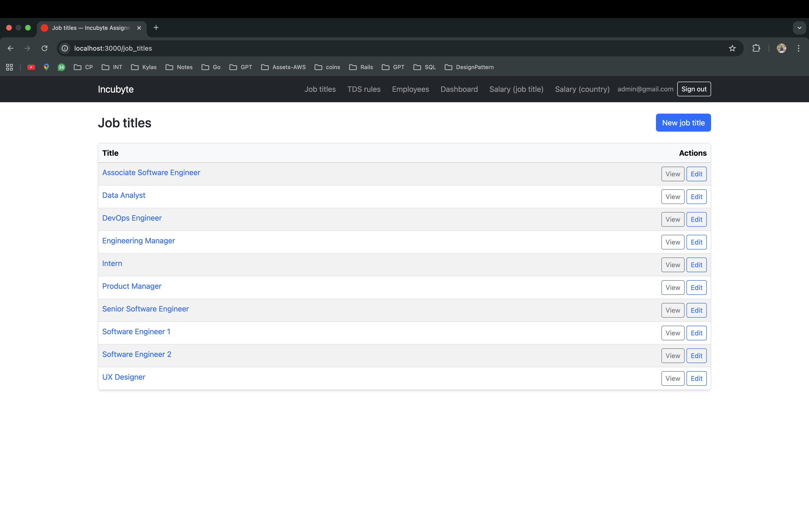

### TDS rules

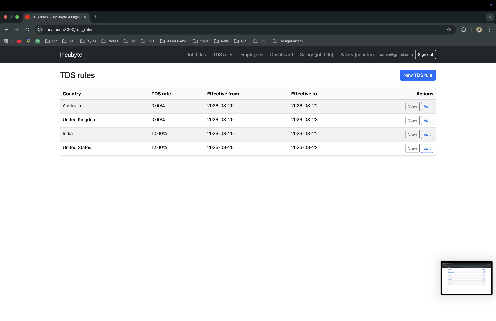

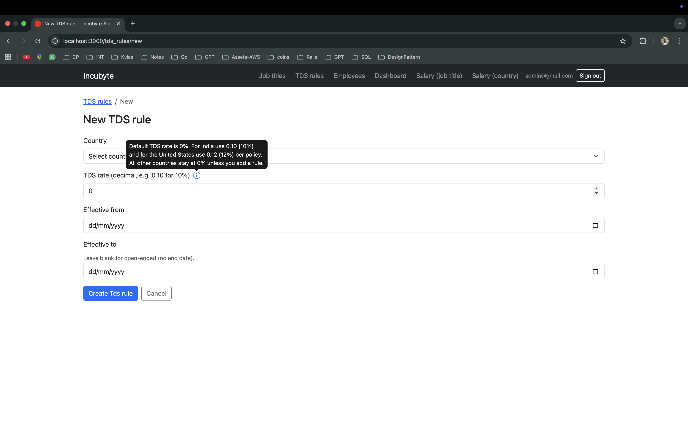

### Salary metrics

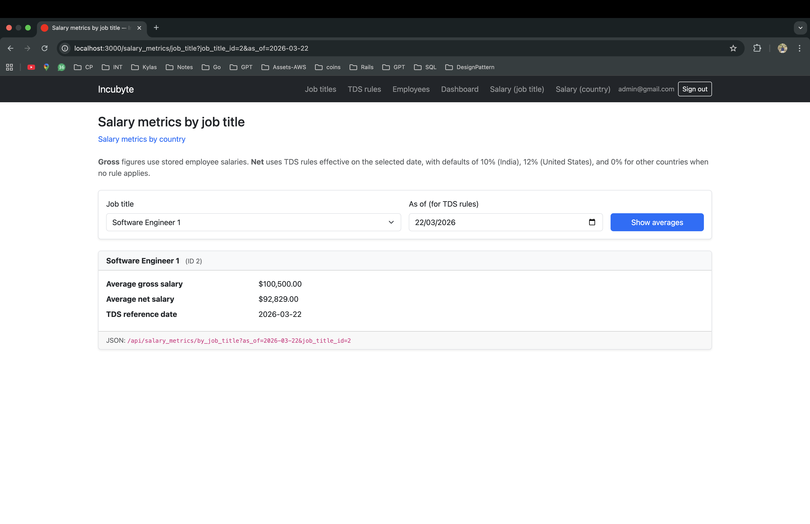

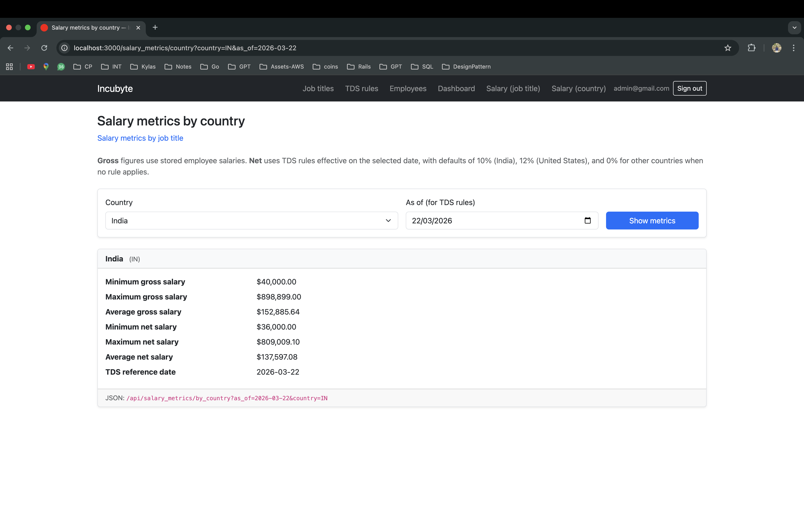

### Dashboard

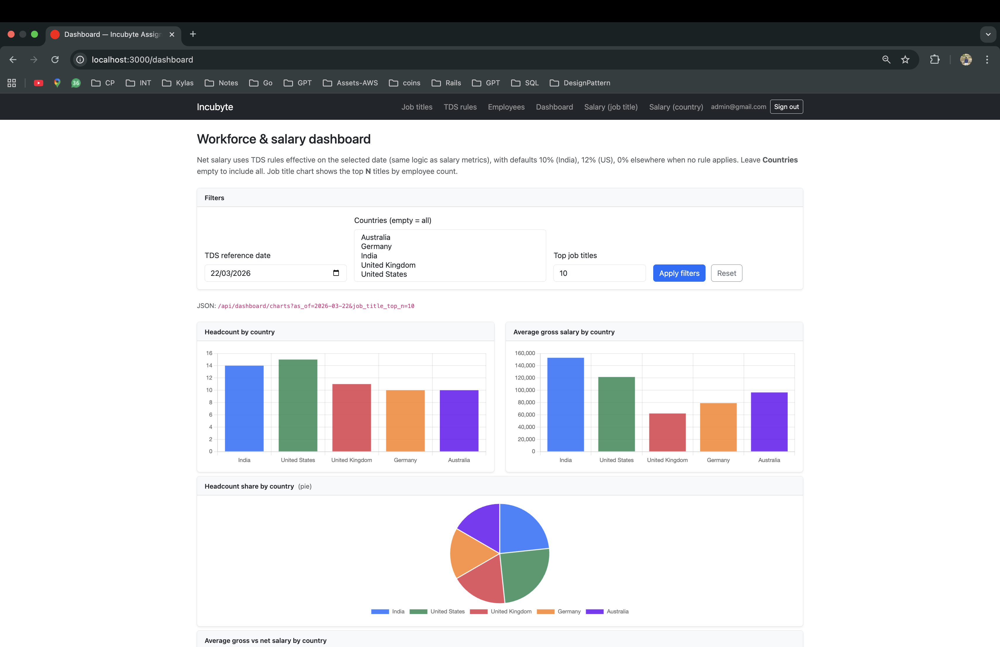

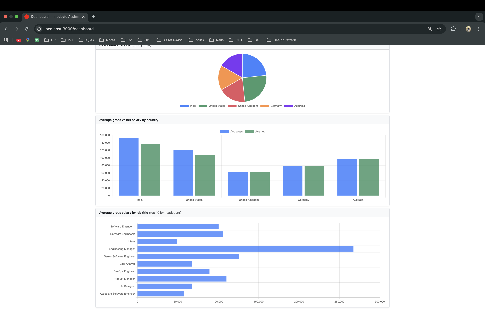

## Dashboard: metrics and filters

The dashboard (`DashboardController#show`) loads **`Dashboard::ChartData`** with:

| Query param | Effect |
|-------------|--------|
| **`as_of`** | **TDS reference date** (parsed via `SalaryMetrics::ForJobTitle.parse_as_of`). Used to resolve each employee’s TDS rate for **average net** and gross-vs-net charts. |
| **`countries[]`** | Multi-select **country codes**. **Omit or leave empty** → all countries in `Countries::KEYS` (catalog order). Invalid codes are ignored. |
| **`job_title_top_n`** | **Top N job titles by headcount** for the horizontal bar chart (clamped 1–50; default **10**). |

**Charts (high level):**

- Headcount by country; average gross by country; headcount share (pie if ≤ 6 countries in the filtered set, else bar); average gross vs net by country; average gross by job title (top N by headcount).

**JSON:** `GET /api/dashboard/charts?as_of=YYYY-MM-DD&job_title_top_n=10&countries[]=IN&countries[]=US` returns the same payload the page embeds (labels + series for Chart.js).

## TDS rules: behavior and fallback

Rules are stored in **`tds_rules`**. Each row has:

- **`country`** — must be one of `Countries::KEYS`.
- **`tds_rate`** — decimal between **0** and **1** (e.g. `0.10` = 10%).
- **`effective_from`** — start date (inclusive).
- **`effective_to`** — optional end date; **`NULL` means open-ended** (treated as running to a far-future sentinel internally for overlap checks).

**Uniqueness:** one row per `(country, effective_from)`. **Validation:** date ranges for the same country **must not overlap**.

### Which rate applies? (`TdsRule.effective_tds_rate_for_country`)

For a given `country` and date `as_of`:

1. If the country code is **not** in the allowed catalog → **`0`** (no default map for unknown codes).
2. Otherwise, look for an **applicable rule**: `effective_from <= as_of` and (`effective_to` is null **or** `effective_to >= as_of`). If several match, the row with the **latest `effective_from`** wins.
3. If **no rule applies** → **fallback defaults** (not stored in DB):
   - **IN** → **10%** (`0.10`)
   - **US** → **12%** (`0.12`)
   - **Any other allowed country** → **0%**

Net salary for metrics/charts uses: **`gross × (1 − effective_rate)`**.

## Seeds

`db/seeds.rb` is **idempotent** (`find_or_create_by!`):

- **Job titles:** Intern, Associate Software Engineer, Software Engineer 1/2, Senior Software Engineer, Engineering Manager, Product Manager, UX Designer, Data Analyst, DevOps Engineer.
- **Employees:** One synthetic roster covering **every** `Countries::KEYS` country and **every** job title, with varied salaries so dashboards and metrics are meaningful.

Run after migrations:

```bash
bin/rails db:seed
```

Seeds do **not** create an **Admin**; use sign-up or the console (see [Run the app](#run-the-app)).

## Configuration notes

- **Pagination:** `WillPaginate.per_page` is set in `config/initializers/will_paginate.rb` (default **10** for listing pages that use `.paginate`).
- **TDS / countries:** Country lists and labels come from the `Countries` module; keep employee and TDS `country` values aligned with those keys.
